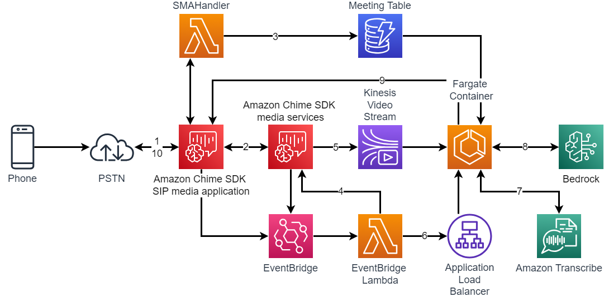
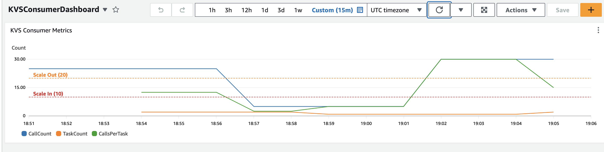

# Amazon Chime SDK media streams demo

## Overview



1. A call is placed to an Amazon Chime SDK SIP media application (SMA) number
2. The SMA handler creates an Amazon Chime SDK meeting and stores the transactionId in the Dynamo DB table
3. The call is joined to the Amazon Chime SDK meeting
4. Once the meeting has been created and joined, using EventBridge notifications, a `CreateMediaStreamPipelineCommand` request is made to start KVS output from the Amazon Chime SDK meeting
5. The Amazon Chime SDK meeting begins streaming the attendee's audio to KVS
6. Once the KVS stream is established, an EventBridge notification triggers the EventBridge Lambda which invokes the Fargate container
7. Within the KVS Consumer
   1. The KVS stream reads the MKV data from the KVS stream
   2. This stream is passed through `ffmpeg` to convert AAC to OPUS
   3. The OPUS stream is sent to Amazon Transcribe for processing
8. When a non-Partial Transcribe event is received, it is sent to Amazon Bedrock with a prompt
9. The response from Amazon Bedrock is sent to the SIP media application using `UpdateSipMediaApplicationCall`
10. The SIP media application takes the text and returns a `SpeakAction` to play this audio to the called party

## Media stream pipelines

To use the Amazon Chime SDK media stream pipelines, an Amazon Kinesis Video Streams (KVS) pool must be created. This pool is created during deployment of the CDK using `cdk-amazon-chime-resources`:

```typescript
this.kinesisVideoStreamPool = new KinesisVideoStreamPool(
  this,
  'kinesisVideoPoolStream',
  {
    streamConfiguration: {
      dataRetentionInHours: 1,
      region: 'us-east-1',
    },
  },
);
```

This pool of Amazon Kinesis Video Streams will be used when [`CreateMediaStreamPipeline`](https://docs.aws.amazon.com/chime-sdk/latest/APIReference/API_media-pipelines-chime_CreateMediaStreamPipeline.html) is called. In this example, this is created for `INDIVIDUAL_AUDIO` by the Lambda triggered by the EventBridge notification.

```typescript
async function startMediaStreamPipeline(eventDetail: MeetingEventDetails) {
  try {
    const params = {
      Sinks: [
        {
          MediaStreamType: MediaStreamType.IndividualAudio,
          ReservedStreamCapacity: 1,
          SinkArn: KINESIS_VIDEO_STREAM_POOL_ARN,
          SinkType: MediaStreamPipelineSinkType.KinesisVideoStreamPool,
        },
      ],
      Sources: [
        {
          SourceArn: `arn:aws:chime:${AWS_REGION}:${AWS_ACCOUNT}:meeting/${eventDetail.meetingId}`,
          SourceType: MediaPipelineSourceType.ChimeSdkMeeting,
        },
      ],
    };
    console.log(
      `CreateMediaStreamPipeline Params: ${JSON.stringify(params, null, 2)}`,
    );
    await chimeSdkMediaPipelinesClient.send(
      new CreateMediaStreamPipelineCommand(params),
    );
  } catch (error) {
    throw new Error(`Error starting Streaming Pipeline: ${error}`);
  }
}
```

## Invoking the KVS Consumer

Once the Amazon Chime SDK media stream has started, the EventBridge notification will trigger.

```typescript
    case DetailType.CHIME_MEDIA_PIPELINE_STATE_CHANGE:
      switch (event.detail.eventType) {
        case MediaStreamPipelineEventType.MediaPipelineKinesisVideoStreamStart:
          console.log('MediaPipelineKinesisVideoStreamStart');
          const consumerInfo = {
            startFragmentNumber: event.detail.startFragmentNumber,
            meetingId: event.detail.meetingId,
            attendeeId: event.detail.attendeeId,
            callStreamingStartTime: event.detail.startTime,
            callerStreamArn: event.detail.kinesisVideoStreamArn,
          };
          await startConsumer(consumerInfo);
          break;
        case MediaStreamPipelineEventType.MediaPipelineKinesisVideoStreamEnd:
          console.log('MediaPipelineKinesisVideoStreamEnd');
          break;
      }
      break;
```

We will capture this information and pass it to our KVS Consumer.

```typescript
async function startConsumer(consumerInfo: ConsumerInfo) {
  console.log('Starting Consumer');
  try {
    const response = await axios.post(
      `http://${KVS_CONSUMER_URL}/call`,
      consumerInfo,
    );
    console.log('POST request response:', response.data);
  } catch (error) {
    console.error('Error:', error);
    throw error;
  }
}
```

## Consuming the KVS

Once the consumer has been invoked, it will begin processing the stream.

```typescript
const response = await kvClient.send(getDataCmd);
const mediaClient = new KinesisVideoMedia({
  region: REGION,
  endpoint: response.DataEndpoint,
});
const fragmentSelector: GetMediaCommandInput = {
  StreamARN: streamArn,
  StartSelector: {
    StartSelectorType: StartSelectorType.NOW,
  },
};
const result = await mediaClient.getMedia(fragmentSelector);
```

This will get the media from the KVS stream for processing.

## Converting the stream

The incoming KVS stream from Amazon Chime SDK meeting is in AAC format. Because Amazon Transcribe cannot support AAC format, we must convert it to something it can. We will use [`ffmpeg`](https://ffmpeg.org/) to convert the stream from AAC or OPUS which can be used by Amazon Transcribe.

```typescript
const readableStream = (await result.Payload) as Readable;
const outputStream = new PassThrough();

ffmpeg(readableStream)
  .audioCodec('libopus')
  .format('opus')
  .output(outputStream, { end: true })
  .run();

startTranscription(outputStream, meetingId).catch((error) => {
  console.error('Transcription error:', error);
});
```

## Sending to Amazon Transcribe

Once converted, we will send the stream to Amazon Transcribe.

```typescript
const client = new TranscribeStreamingClient({ region: REGION });

const audioStream = async function* () {
  for await (const chunk of stream) {
    yield { AudioEvent: { AudioChunk: chunk } };
  }
};

const command = new StartStreamTranscriptionCommand({
  LanguageCode: LanguageCode.EN_US,
  MediaEncoding: MediaEncoding.OGG_OPUS,
  MediaSampleRateHertz: 48000,
  AudioStream: audioStream(),
});

const response = await client.send(command);
```

## Processing response

> You will need to [enable Bedrock model access](https://docs.aws.amazon.com/bedrock/latest/userguide/model-access.html) for your account to use this feature. This demo uses `anthropic.claude-instant-v1` as the default but you can experiment with other foundation models.

When we get a response from Amazon Transcribe, we must process it. In this demo, we're looking for non-partial results. These transcriptions will contain an entire segment that be can used with Amazon Bedrock.

```typescript
if (response.TranscriptResultStream) {
  for await (const event of response.TranscriptResultStream) {
    console.log(event);
    if (
      event.TranscriptEvent &&
      event.TranscriptEvent &&
      event.TranscriptEvent.Transcript &&
      event.TranscriptEvent.Transcript.Results &&
      event.TranscriptEvent.Transcript.Results.length > 0 &&
      event.TranscriptEvent.Transcript.Results[0].IsPartial == false
    ) {
      console.log(
        'NonPartial Event: ',
        JSON.stringify(event.TranscriptEvent.Transcript),
      );
      const databaseResponse = await readMeetingInfoFromDB(meetingId);
      await updateSIPMediaApplication({
        transactionId: databaseResponse!.transactionId!.S!,
        action: 'Thinking',
      });
      const prompt = preparePrompt(
        event.TranscriptEvent.Transcript.Results[0].Alternatives![0]
          .Transcript!,
      );
      console.log('Prompt: ', prompt);
      const bedrockResponse = await bedrockClient.send(
        new InvokeModelCommand(prompt),
      );

      let text = JSON.parse(
        new TextDecoder().decode(bedrockResponse.body),
      ).completion;
      text = text.replace(/'/g, '’'); // Replacing ' with ’
      text = text.replace(/:/g, '.'); // Replacing : with .
      text = text.replace(/\n/g, ' '); // Remove \n
      console.log('Bedrock Text: ', text);

      await updateSIPMediaApplication({
        transactionId: databaseResponse!.transactionId!.S!,
        action: 'Response',
        text: text,
      });
    }
  }
} else {
  console.error('TranscriptResultStream is undefined');
}
```

Once a non-partial event is received, a series of steps are taken.

1. Query the Amazon DynamoDB to find the `transactionId` associated with the `meetingId`
2. Use `UpdateSipMediaApplicationCall` to send comfort `Thinking` noise to the caller
3. Prepare the prompt for processing with Amazon Bedrock
4. Invoke the Bedrock Model with the prepared prompt
5. Parse and prepare message for the SIP media application
6. Send the response to the SIP media application using `UpdateSipMediaApplicationCall`

## Preparing prompt

Because we are using Anthropic Claude, we must [prepare a prompt](https://docs.anthropic.com/claude/docs/introduction-to-prompt-design) that it can understand using the [general guidelines for Bedrock](https://docs.aws.amazon.com/bedrock/latest/userguide/general-guidelines-for-bedrock-users.html).

```typescript
function preparePrompt(promptRequest: string) {
  return {
    body: JSON.stringify({
      prompt:
        '\n\nHuman: This is a questions from a caller.  In a few sentences provide an answer to this question.\n\n' +
        promptRequest +
        '\n\nAssistant:',
      max_tokens_to_sample: 4000,
    }),
    modelId: BEDROCK_MODEL,
    accept: 'application/json',
    contentType: 'application/json',
  };
}
```

## Playing response

Finally, once the response has been sent to the SIP media application handler, we will play the audio to the caller.

```typescript
    case InvocationEventType.CALL_UPDATE_REQUESTED:
      console.log('CALL_UPDATE_REQUESTED');
      switch (event.ActionData?.Parameters.Arguments.Function) {
        case 'Response':
          actions = [
            speakAction(
              event.ActionData!.Parameters.Arguments.Text,
              transactionAttributes.CallIdLegA,
            ),
          ];
          break;
        case 'Thinking':
          actions = [playAudioAction(transactionAttributes.CallIdLegA)];
          break;
        default:
          break;
      }
      break;
```

## Scaling AWS Fargate

Because this demo uses AWS Fargate for the KVS consumption and processing, we will need to ensure that sufficient resources are available. To accomplish this, we will use [Application Auto Scaling](https://docs.aws.amazon.com/autoscaling/application/userguide/what-is-application-auto-scaling.html).

First, we will define the Fargate service with auto-scaling enabled.

```typescript
const scalableTarget = this.fargateService.service.autoScaleTaskCount({
  minCapacity: 1,
  maxCapacity: 10,
});

scalableTarget.scaleOnMetric('ScaleOnCallsPerTask', {
  metric: props.callsPerTaskMetric,
  scalingSteps: [
    { upper: 10, change: -1 },
    { lower: 20, change: +1 },
  ],
  adjustmentType: AdjustmentType.CHANGE_IN_CAPACITY,
});
```

Here we are defining a Task Count with a minimum tasks of 1 and maximum tasks of 10. Next, we define the metric to scale on, and the parameters to scale on. In this demo, we define 20 calls per task as the limit to scale out on, and 10 calls per task as the limit to scale in on. There is still a minimum of 1 task, so we will never scale in below that. These numbers are just an example and should be adjusted based on your testing.

The metric used to scale on is `CallsPerTaskMetric`. Let's see how we define that.

### Calls Per Task Metric

First, we will define the metrics we will use.

```typescript
const currentCallsMetric = new Metric({
  metricName: 'CallCount',
  namespace: 'AmazonChimeSDKKVSProcessing',
  region: Stack.of(this).region,
  statistic: Statistic.Average,
  period: Duration.minutes(1),
});

const currentTasksMetric = new Metric({
  metricName: 'TaskCount',
  namespace: 'AmazonChimeSDKKVSProcessing',
  region: Stack.of(this).region,
  statistic: Statistic.Average,
  period: Duration.minutes(1),
});

this.callsPerTaskMetric = new Metric({
  metricName: 'CallsPerTask',
  namespace: 'AmazonChimeSDKKVSProcessing',
  region: Stack.of(this).region,
  statistic: Statistic.Average,
  period: Duration.minutes(1),
});
```

### CallCount

To keep track of `CallCount`, we will use a DynamoDB Table. When a call comes in, we will increment the count by 1. When a call is disconnected, we will decrement the count by 1. This way, we can keep an accurate count of all calls in progress. This is done in the `SMAHandler` Lambda Function.

```typescript
async function updateCallCount(value: number) {
  console.log(`Updating call count with : ${value}`);
  try {
    const updateParams = {
      TableName: CALL_COUNT_TABLE,
      Key: { pk: { S: 'currentCalls' } },
      UpdateExpression: 'ADD #calls :val',
      ExpressionAttributeNames: {
        '#calls': 'calls',
      },
      ExpressionAttributeValues: {
        ':val': { N: value.toString() },
      },
    };

    const response = await ddbClient.send(new UpdateItemCommand(updateParams));
    console.log(response);
  } catch (error) {
    console.error('Error:', error);
  }
}
```

### TaskCount and CallsPerTask

Now that we have a record of the active calls in progress, we can calculate the calls per task. To do this, we will configure a Lambda function to run periodically (every minute) to check the `CallCount` and the `TaskCount` and calculate the `CallsPerTask`. We can query the DynamoDB Table to determine the `CallCount` and use `DescribeClusters` to determine how many Tasks are currently running.

```typescript
async function getRunningTaskCount(): Promise<number> {
  const ecsClient = new ECSClient({ region: 'us-east-1' });

  const data = await ecsClient.send(
    new DescribeClustersCommand({
      clusters: [FARGATE_CLUSTER],
    }),
  );

  const cluster = data.clusters![0];
  return cluster.runningTasksCount!;
}
```

With this information we can push these three Metrics to CloudWatch.

```typescript
const putMetrics = async (value: number, metricName: string) => {
  const metricData = {
    MetricData: [
      {
        MetricName: metricName,
        Value: value,
        Unit: StandardUnit.Count,
      },
    ],
    Namespace: 'AmazonChimeSDKKVSProcessing',
  };

  await cloudWatchClient.send(new PutMetricDataCommand(metricData));
};
```

The result is an auto-scaling process that will use CloudWatch alarms to scale out when `CallsPerTask` exceeds 20 and scale in when `CallsPerTask` is below 10.



## Requirements

- Docker running
- ARM processor on build/deploy instance

## Deployment

```bash
yarn launch
```

## Cleanup

```bash
yarn cdk destroy
```
